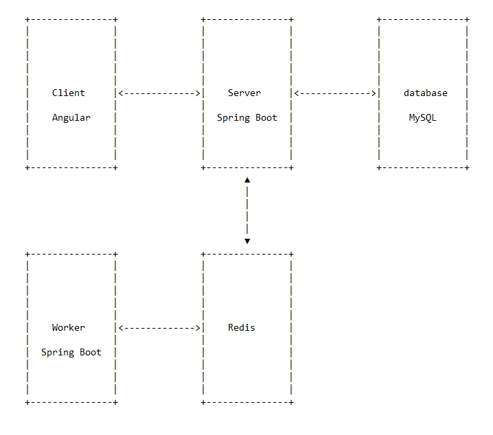
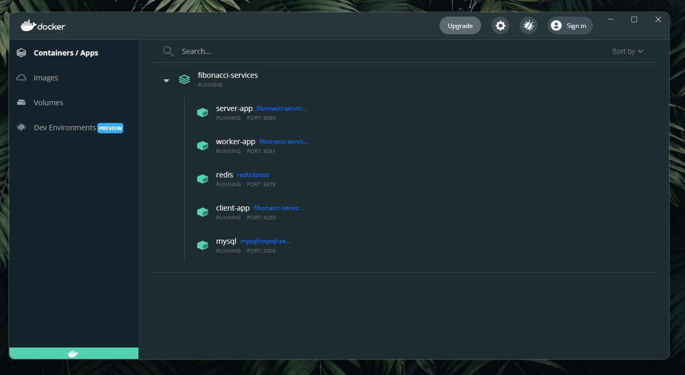
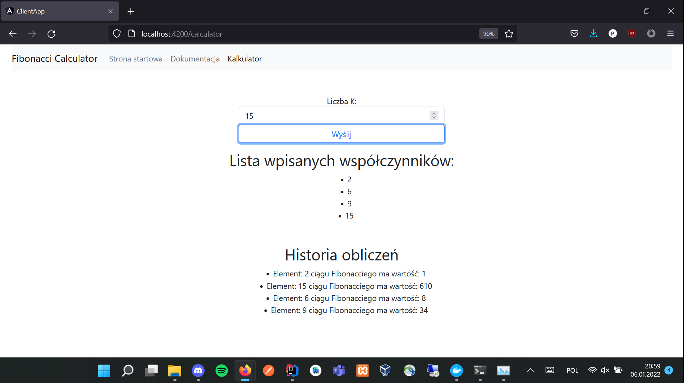

#fibonacci-services
###  Zadanie 1 - Laboratorium PFSwChO
W ramach zadania stworzone rozwiązanie zawierające usługę zbudowaną z 5 serwisów.
Jest ona odwzorowaniem zadania prezentowanego w instrukcji do poprzedniego laboratorium.
Rysunek poniżej prezentuje stworzoną architekturę.

W ramach zadania wykonano serwisy:

 

<h5>client-app [Client]</h5>
Aplikacja kliencka umożliwiająca interakcje użytkownika z systemem (podawanie indeksów do obliczenia,
podgląd wpisanych indeksów i wartości obliczonych). Rozwiązanie to zaimplementowano z wykorzystaniem
szkieletu programistycznego Angular.

<h5>server-app [Server]</h5>
Aplikacja serwerowa mająca za zadanie odbieranie danych z aplikacji klienckiej, zapisywanie danych do bazy,
umieszczanie danych oraz wysyłanie wiadomości w usłudze Redis. Ta część projektu zaimplementowano z użyciem
Spring Boot-a, wykorzystano klienta Jedis do obsługi połączenia z usługą Redis, całość spełnia założenia
architektury REST

<h5>worker-app [Worker]</h5>
Aplikacja mająca za zadanie nasłuchiwanie Redis-a, odbieranie wiadomości, przetwarzanie ich 
oraz umieszczanie w usłudze Redis wyniku swoich działa jakim jest obliczanie wartości ciągu Fibonacciego.

<h5>redis</h5>
W koncepcji tego zadania został on wykorzystany do przechowywania wartości oraz rozsyłania wiadomości

<h5>mysql</h5>
Usługa zawierająca bazę danych potrzebną do realizacji zadania

### Uruchomienie
By uruchomić projekt w terminalu wydaj polecenie:  
`docker compose -f docker-compose.dev.yml up `  
## Docker Desktop
Widoczne na nim porty na jakich postawiono usługi oraz ich stan

## Okno przeglądarki

